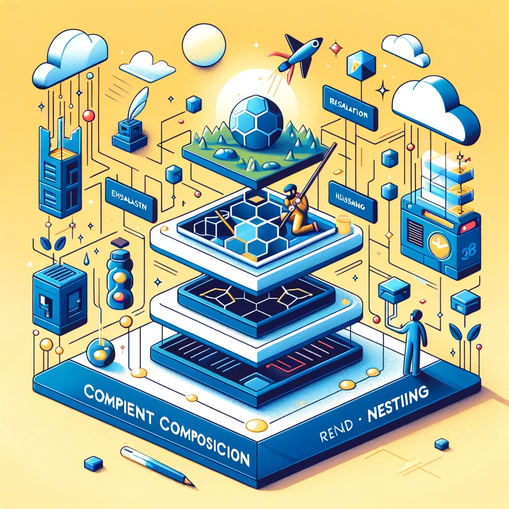

# React - 05: Component Composition and Nesting in React

## Introduction

Mastering component composition and nesting is a cornerstone in React development. It enables developers to create sophisticated and reusable user interfaces efficiently. In this article, we'll explore these concepts in detail, understanding how they form the backbone of React applications.

## Understanding Component Composition

Component composition is about creating complex UIs by combining smaller, independent components.

- ### Encapsulation and Reusability:

  - Encapsulating functionality within components allows for their reuse throughout your application. A well-designed component can be used in multiple contexts.

- ### Example: Building a Modal Component:

  - Imagine creating a Modal component that can be reused with different content.

```jsx
function Modal({ children }) {
  return <div className="modal">{children}</div>;
}
```

- The `children` prop allows you to insert any content into the Modal, making it highly reusable.

## Nesting Components for Hierarchical UI

Nesting is placing one component within another, a common practice in React for building hierarchical UIs.

- ### Creating a Layout with Nested Components:

  - Consider a `PageLayout` component that nests `Header`, `Footer`, and `Content` components.

```jsx
function PageLayout() {
  return (
    <div>
      <Header />
      <Content />
      <Footer />
    </div>
  );
}
```

- ### Advantages of Nesting:

  - Nesting promotes a clear hierarchy and separation of concerns, leading to more manageable code.

## Advanced Composition Techniques

React's flexible nature allows for various advanced composition techniques.

- ### Render Props:

  - Render props is a technique for sharing code between components using a prop whose value is a function.

- ### Higher-Order Components (HOCs):
  - HOCs are functions that take a component and return a new component, typically adding new functionality.

## Handling Complex Component Trees

As applications grow, managing complex component trees becomes crucial.

- ### Context API for Prop Drilling:

  - The Context API helps avoid 'prop drilling' — passing props through multiple layers of components. It provides a way to share values between components without explicitly passing a prop through every level of the tree.

- ### Using Composition Effectively:
  - While composition is powerful, overuse can lead to overly complex component hierarchies. Balancing composition with direct component usage is key.

## Best Practices in Component Composition

- Keep Components Focused: Ensure each component has a single responsibility.
- Avoid Deep Nesting: Deeply nested components can become hard to maintain. Strive for a balance that keeps the component tree manageable.
- Use Composition over Inheritance: Favor composition over inheritance for reusing code between components.



## Conclusion

Component composition and nesting are not just features of React; they're paradigms that encourage thinking in reusable, encapsulated UI segments. Mastering these concepts allows you to build scalable, efficient, and maintainable React applications.

In our next article, we'll explore conditional rendering and managing lists in React, further expanding your ability to create dynamic user interfaces.

---

Hi there, I'm Darshan Jitendra Chobarkar, a freelance web developer who's managed to survive the caffeine-fueled world of coding from the comfort of Pune. If you found the article you just read intriguing (or even if you're just here to silently judge my coding style), why not dive deeper into my digital world? Check out my portfolio at [https://darshanwebdev.com/](https://darshanwebdev.com/) – it's where I showcase my projects, minus the late-night bug fixing drama.

For a more 'professional' glimpse of me (yes, I clean up nice in a LinkedIn profile), connect with me at [https://www.linkedin.com/in/dchobarkar/](https://www.linkedin.com/in/dchobarkar/). Or if you're brave enough to see where the coding magic happens (spoiler: lots of Googling), my GitHub is your destination at [https://github.com/dchobarkar](https://github.com/dchobarkar). And, for those who've enjoyed my take on this blog article, there's more where that came from at [https://dchobarkar.github.io/](https://dchobarkar.github.io/). Dive in, leave a comment, or just enjoy the ride – looking forward to hearing from you!
